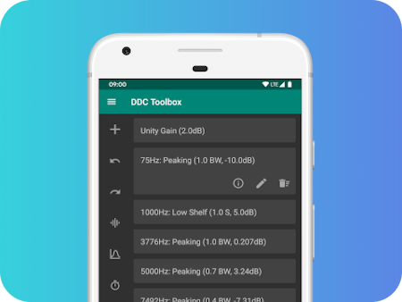

# DDCToolbox-Android
Create and edit VDCs on Android

  

This is a mobile version of DDCToolbox with limited functionality.
It is designed to provide a user-friendly and easy-to-understand interface, in order to allow even less-experienced users to experiment with the DDC feature included in JamesDSP and Viper4Android.

There is also a more advanced [desktop version](https://github.com/ThePBone/DDCToolbox) for Linux, Windows and macOS available.

Note: Unlike the desktop version, this app is not capable of adding or editing custom filters, please use the [desktop version](https://github.com/ThePBone/DDCToolbox) for this. 
  
### Download

  

### Changelogs

You can view changelogs [here](https://github.com/ThePBone/DDCToolbox-Android/releases).

___________________

Google Play and the Google Play logo are trademarks of Google LLC.
